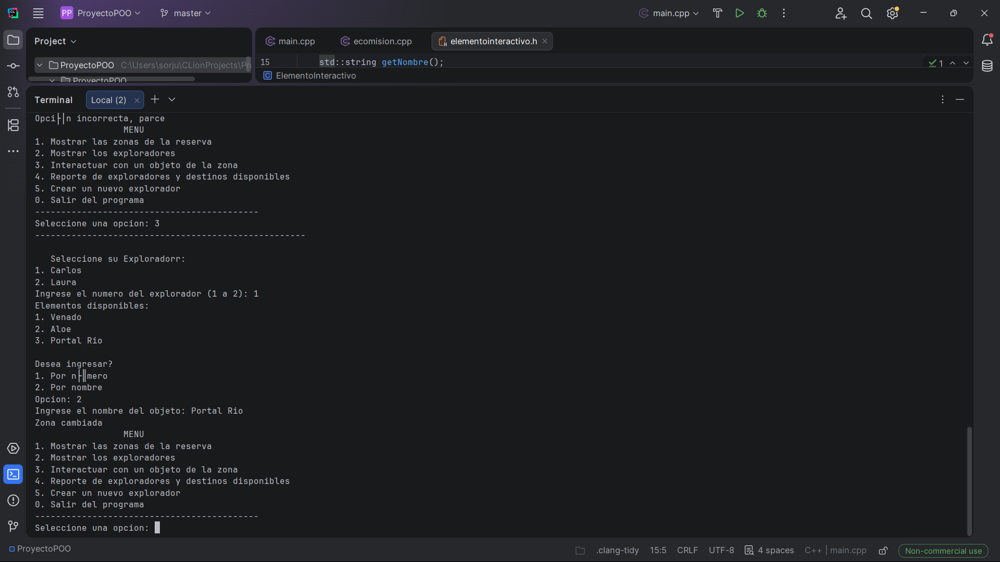
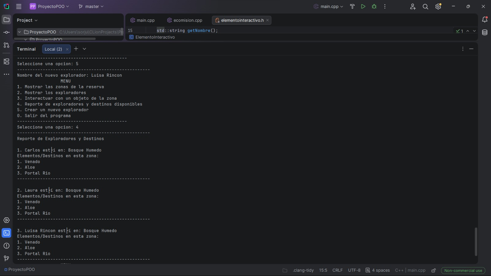
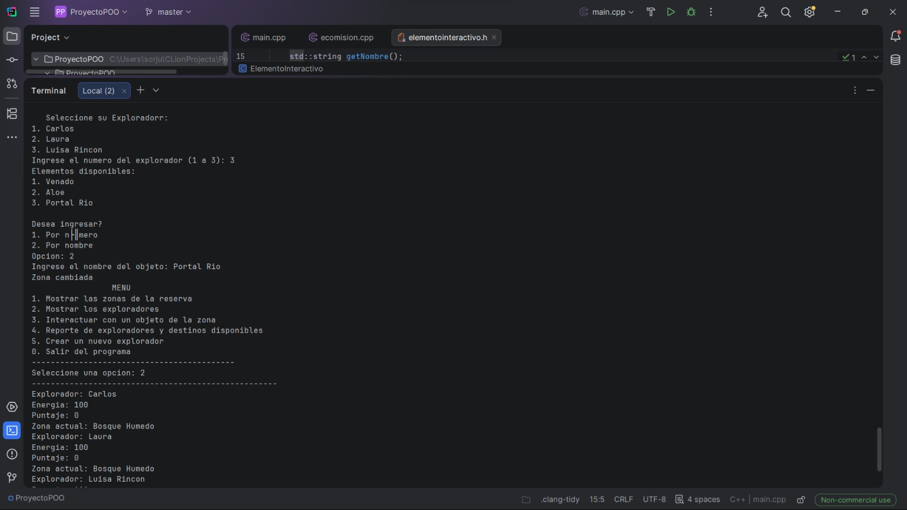

# Netherfield Park 

Proyecto desarrollado en C++ utilizando Programación Orientada a Objetos (POO) para modelar un sistema interactivo de exploración compuesto por zonas, exploradores y elementos interactivos.

---
## Autores

- Sergio Orjuela
- Juan Franco
---

## Descripción

El sistema permite representar diferentes zonas de un entorno natural y la interacción de exploradores con distintos elementos del ecosistema, como:

- Animales heridos
- Estaciones de energía
- Residuos Contaminantes
- Portales de Teletransportación 
- Plantas medicinales

Dichos elementos se agrupan en una selección de biomas, entre los que se encuentran:

- Bosque Húmedo
- Centro de Recuperación Animal
- Laboratorio Ambiental
- Río Contaminado
- Sendero Montañoso
- Vivero

Las reservas, que se componen de una agrupación de zonas, son recorridas por un grupo de exploradores que pueden transportarse e interactuar con todos los elementos a decisión del usuario.

El proyecto fue diseñado aplicando principios fundamentales de POO con una arquitectura modular basada en múltiples clases y archivos separados. Los principales son:

- ecomision.h / ecomision.cpp - Clase Controladora
- elementointeractivo.h / elementointeractivo.cpp - Clase abstracta para los elementos
- zona.h / zona.cpp - Clase abstracta para los biomas
- explorador.cpp - Clase para los personajes
- reserva - Clase para contener zonas 

---

## Características

- Implementación de herencia y polimorfismo.
- Sistema modular usando archivos `.h` y `.cpp`.
- Interacción dinámica entre objetos.
- Manejo de zonas y elementos interactivos.
- Diseño extensible para agregar nuevas entidades.

---

## Proceso de Compilación y Ejecución

Para compilar correctamente el proyecto, ejecutar:
```bash
g++.exe ProyectoPOO/main.cpp ProyectoPOO/src/ecomision.cpp ProyectoPOO/src/elementointeractivo.cpp ProyectoPOO/src/explorador.cpp ProyectoPOO/src/reserva.cpp ProyectoPOO/src/zona.cpp ProyectoPOO/src/ElementosInteractivos/animalherido.cpp ProyectoPOO/src/ElementosInteractivos/estacionenergia.cpp ProyectoPOO/src/ElementosInteractivos/plantamedicinal.cpp ProyectoPOO/src/ElementosInteractivos/portaltp.cpp ProyectoPOO/src/ElementosInteractivos/residuocontaminante.cpp ProyectoPOO/src/Zonas/bosquehumedo.cpp ProyectoPOO/src/Zonas/centrorecoanimal.cpp ProyectoPOO/src/Zonas/labambiental.cpp ProyectoPOO/src/Zonas/riocontaminado.cpp ProyectoPOO/src/Zonas/senderomontanoso.cpp ProyectoPOO/src/Zonas/vivero.cpp -I ProyectoPOO/include -I ProyectoPOO/include/ElementosInteractivos -I ProyectoPOO/include/Zonas -o main
```
Una vez compilado el proyecto, luego ejecutar:

```bash
.\main.exe
```

---


## Demostración del Proyecto en Funcionamiento


Evidencia del programa accediendo a los objetos de zona: 


<p align="center">
  
</p>


Evidencia del programa creando un nuevo explorador:

<p align="center">
  
</p>


Evidencia del cambio de zona para el nuevo explorador:


<p align="center">
  
</p>
---
-README hecho con ayuda de IA generativa

